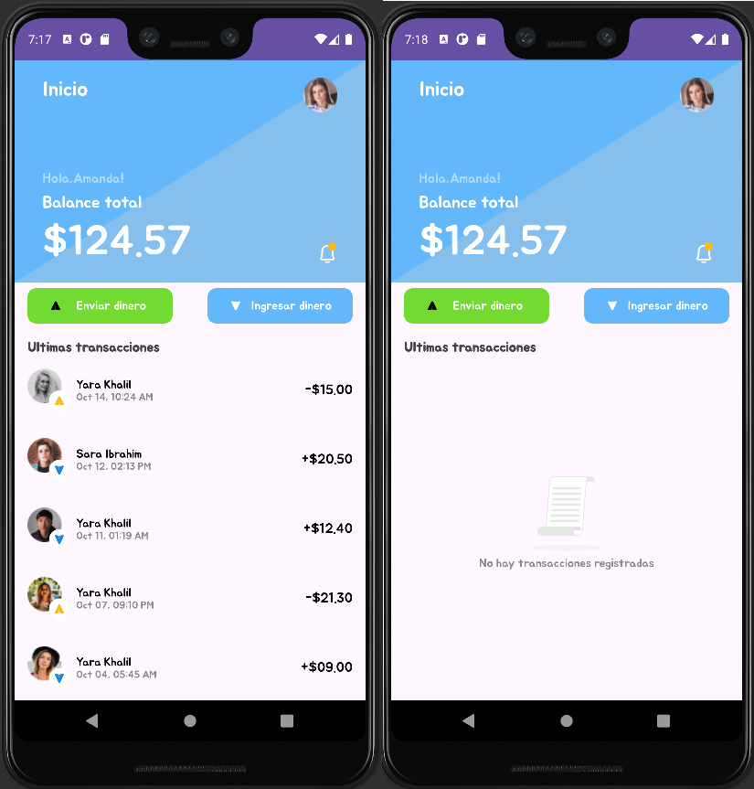

<div align="center">
  <br>
    <h2><strong>Proyecto Desarrollo Android - VirtualWallet</strong> </br>  </h2>
    <span>Evaluacion Integradora Modulo 4 Desarrollo Android</span><br>
    <span>Juan Pino Contreras.</span>
  <br>
</div>



#### Notas del desarrollador:
- En la ventana Home page, al hacer click en el icono _campana de notificaciones_ mostrara en el FrameLayout inferior la lista de transacciones.
- Al hacer clicn en _foto de perfil_ se mostrara la ventana Profile
- En las ventanas _Request Money_ y _Send Money_, la flecha hacia atrás del MaterialToolbar ubicado en la parte superior, envia al usuario devuelta al _Home_.
****
## 💸 VirtualWallet

En este proyecto se aplican conceptos de diseño y programacion en una aplicacion movil para el entorno Android. Esta diseñada para demostrar la estructura básica de una aplicación Android utilizando XML, Java, actividades, fragmentos, diseño en figma y navegacion entre componentes. 


## 📲Pantallas

  - **Splash Screen**: Pantalla de presentación inicial de la aplicación.
  - **Login/Signup**: Pantalla que permite al usuario iniciar sesión o registrarse.
  - **Signup**: Pantalla de registro para nuevos usuarios.
  - **Home**: Pantalla principal después de iniciar sesión, se organiza en un FrameLayout superior (head) y un FrameLayout inferior donde se presentan las transacciones.
  - **Home Page- Empty Case**: Pantalla de inicio con un caso de uso vacío, no existen transacciones.
  - **Request Money**: Pantalla para depositar dinero.
  - **Send Money**: Pantalla para enviar dinero a un perfil de usuario seleccionado.
  - **Profile**: Pantalla con datos del usuario y botones de uso y configuracion del perfil.


## 🔩 Requisitos

1. **Configuración del Entorno**:
   *Java Development Kit (JDK)*
    - Android Studio requiere el JDK para compilar y ejecutar aplicaciones. Asegúrate de tener instalada una versión compatible del JDK

2. **Descarga y Clonación**:
   - Clona este repositorio en tu máquina local utilizando Git:
     ```bash
     git clone https://github.com/Jvbass/AppVirtualWallet
     ```
3. **Android Studio**
    - Debes tener instalado Android Studio en tu sistema. Descargalo y abre el proyecto navegando a la carpeta donde lo clonaste.
## 🤝 Contribuciones

¡Las contribuciones siempre son bienvenidas! Si tienes ejercicios adicionales, mejoras en las soluciones existentes o cualquier otro aporte que creas que pueda beneficiar a otros usuarios, no dudes en abrir un [_pull request_](https://github.com/Jvbass/AppVirtualWallet/pulls) o contactarme.

#### _Gracias por tu interés en este proyecto. Si tienes algun comentario o duda sobre este o cualquier otro proyecto no dudes en contactarme._
###### ¡Espero tus _PR_!👋
